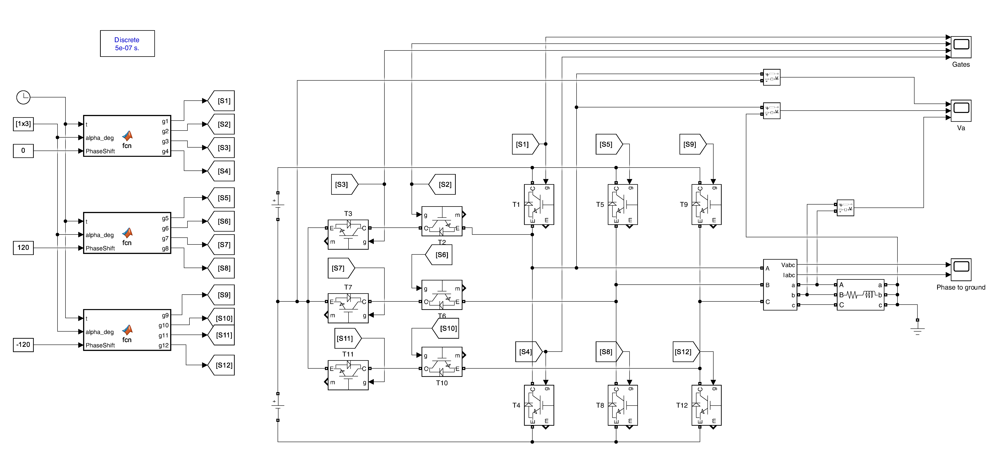
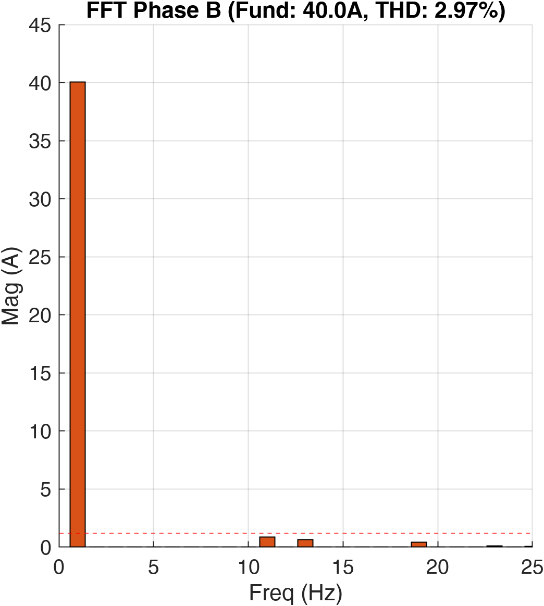

# Design and Harmonic Analysis of a Three-Phase Three-Level T-Type Inverter utilizing SHE Control

## Overview
This repository contains the design, mathematical modeling, and simulation of a grid-compatible Three-Phase Three-Level T-Type Voltage Source Inverter (VSI). The project implements a Unipolar Selective Harmonic Elimination (SHE) control strategy to regulate the fundamental output voltage while rigorously suppressing the $5^{th}$ and $7^{th}$ harmonic orders. 

The system is modeled and simulated in the MATLAB/Simulink environment, featuring a specialized gate logic algorithm to ensure stable neutral-point clamping, which is critical for the T-Type topology.

## 🎯 Problem Statement (Project Requirements)
The objective of this project is to design and simulate a **Three-phase Three-level T-type inverter** with a DC link voltage ($V_{DC}$) of 800V, feeding an RL load with an impedance of $7.07 + j7.07\,\Omega$ at a fundamental frequency of 50Hz.

The specific requirements were:
1.  **Control Strategy:** Apply Unipolar Selective Harmonic Elimination (SHE) utilizing three switching angles ($\alpha_1, \alpha_2, \alpha_3$) for each leg to control the fundamental output voltage magnitude to **400V** and eliminate the first two significant harmonics (5th and 7th).
2.  **Numerical Solution:** Develop a MATLAB script (`m-file`) to accurately estimate the values of the switching angles, assuming initial guesses of $20^\circ$, $40^\circ$, and $60^\circ$.
3.  **Simulation & Analysis:** Build a comprehensive Simulink model and extract the following results with their Fast Fourier Transform (FFT) spectrum:
    *   Pole voltage ($V_{ao}$)
    *   Phase voltage ($V_{an}$)
    *   Line-to-line voltage ($V_{ab}$)
    *   Phase currents and their FFT
    *   Phase current Total Harmonic Distortion (THD)

## 🌟 Extra Feature: Interactive MATLAB GUI Application
Beyond the standard requirements, a custom MATLAB-based Graphical User Interface (GUI) application titled **"SHE Inverter Analysis Tool"** was developed from scratch. 
*   **Integrated Workflow:** Combines the Newton-Raphson numerical solver (`fsolve`), time-domain simulation, and FFT spectral processor into a single interactive dashboard.
*   **Dynamic Customization:** Allows real-time modification of system parameters (DC link voltage, target fundamental voltage, frequency, and load impedance).
*   **Automated Reporting:** Features built-in export capabilities to automatically generate simulation text reports and high-resolution (300 DPI) visualization plots for all waveforms, FFT spectrums, power flow, gate signals, and angle trajectories.

## Key Features & Achievements
*   **Topology:** Three-Phase Three-Level T-Type Inverter.
*   **Control Strategy:** Unipolar Selective Harmonic Elimination (SHE).
*   **Harmonic Suppression:** Successfully eliminated the $5^{th}$ ($250\text{Hz}$) and $7^{th}$ ($350\text{Hz}$) harmonics.
*   **Power Quality:** Achieved a highly sinusoidal output with a Current Total Harmonic Distortion (THD) of **$2.98\%$** (well within international standards of $<5\%$).
*   **Gate Drive Logic Optimization:** Implemented a custom state-machine logic in MATLAB to actively clamp the output to the neutral point during zero-voltage states, establishing a bidirectional current path and preventing waveform distortion.

## System Parameters
| Parameter | Value |
| :--- | :--- |
| DC Link Voltage ($V_{DC}$) | $800\text{V}$ ($\pm 400\text{V}$) |
| Target Fundamental Phase Voltage ($V_{fund}$) | $400\text{V}$ (Peak) |
| Fundamental Frequency ($f$) | $50\text{Hz}$ |
| Load Impedance ($Z = R + jX$) | $7.07 + j7.07\,\Omega$ (Series RL) |
| Modulation Index ($M_a$) | $1.0$ |

## Repository Structure
*   `Simulation/`: Contains the MATLAB script (`SHE_Inverter_Task_Final.m`) with the GUI and numerical solver, along with the Simulink model (`final_t_type_inverter.slx`).
*   `Docs/`: Contains the final project report (`she_t_type_inverter.pdf`) and the simulation results summary (`Simulation_Results_Report.txt`).
*   `Docs/LaTeX_Source/`: Contains the LaTeX source code and associated image files used to generate the final report.

## How to Run
1.  Clone this repository or download the files.
2.  Open MATLAB.
3.  Navigate to the `Simulation/` directory.
4.  Run the `SHE_Inverter_Task_Final.m` script to launch the interactive GUI tool.
5.  Set your desired system parameters or use the default values.
6.  Click **"CALCULATE & SIMULATE"** to solve the SHE equations and run the analysis.
7.  Alternatively, you can directly open and run the Simulink model `final_t_type_inverter.slx`.

## Results
The simulation results validate the effectiveness of the T-Type topology combined with the SHE control strategy. 

*   **Line Voltage ($V_{ab}$):** Displays a 5-level staircase waveform ($+800, +400, 0, -400, -800$V), significantly improving the harmonic spectrum.
*   **FFT Analysis:** Confirms the complete suppression of the $5^{th}$ and $7^{th}$ harmonics in the pole voltage.
*   **Power Flow:** The system demonstrates an estimated efficiency of $97.7\%$ and a power factor of $0.67$ (matching the theoretical prediction for the specified load).

### FFT Analysis of Three-Phase Load Currents
| Phase A | Phase B | Phase C |
| :---: | :---: | :---: |
|  |  |  |
| **THD: 2.98%** | **THD: 2.97%** | **THD: 2.97%** |

## Author
**Abd El-Rahman Muhammad Saad Muhammad**
*   **University:** Alexandria University
*   **Department:** Electrical Engineering

---
*Note: This project was completed as part of the Power Electronics Applications coursework.*
