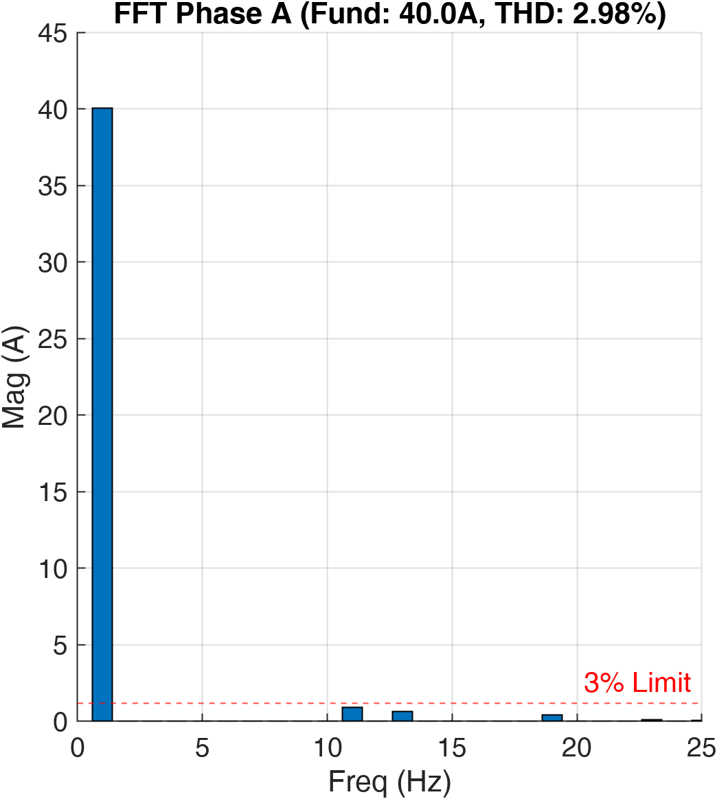
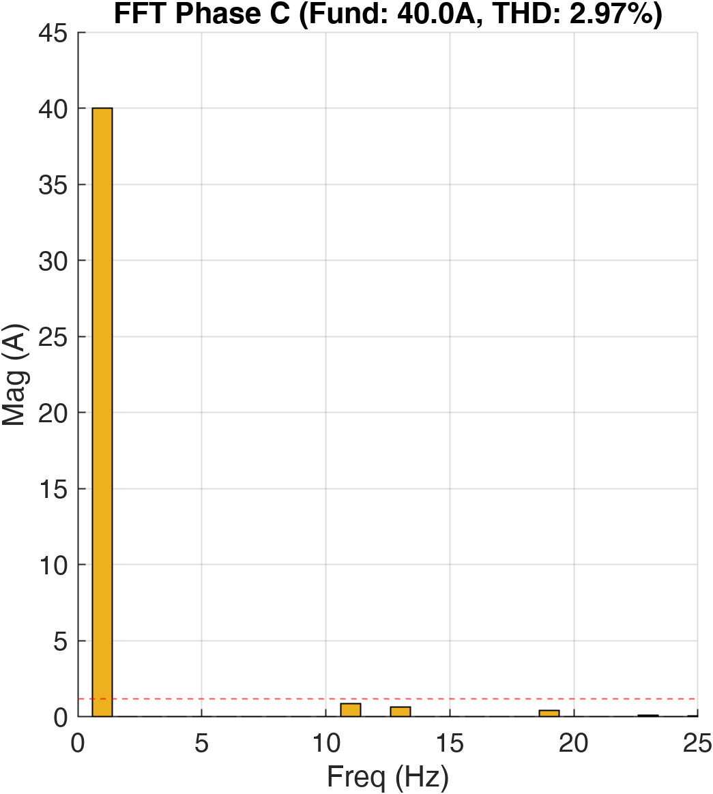

# Three-Phase Three-Level T-Type Inverter with SHE Control

## Overview
Design, modeling and simulation of a **three-phase three-level T-Type inverter** controlled with **Unipolar Selective Harmonic Elimination (SHE)**. The switching angles are chosen to set the fundamental output voltage and eliminate the **5th and 7th** harmonics. The Simulink model includes a gate-logic state machine that clamps the output to the neutral point during zero-voltage states.

## 🎯 Problem Statement
Design and simulate a three-phase three-level T-type inverter with an **800 V** DC link feeding an RL load of **7.07 + j7.07 Ω** at **50 Hz**:
1. Apply unipolar SHE with three switching angles (α₁, α₂, α₃) per leg to set the fundamental output to **400 V** and eliminate the 5th and 7th harmonics.
2. Write a MATLAB script that solves for the angles (initial guesses 20°, 40°, 60°).
3. Build the Simulink model and report pole voltage (Vao), phase voltage (Van), line voltage (Vab), phase currents, their FFT, and the current THD.

## 🌟 Extra: "SHE Inverter Analysis Tool" (MATLAB GUI)
A MATLAB `uifigure` application that combines the angle solver (`fsolve`), the time-domain simulation and the FFT analysis in one dashboard.
* Editable parameters: DC-link voltage, target fundamental voltage, frequency and load impedance.
* One-click **CALCULATE & SIMULATE**.
* Exports a text report and high-resolution (300 DPI) plots of waveforms, FFT spectra, power flow, gate signals and angle trajectories.

## 🔧 System Parameters
| Parameter | Value |
| :--- | :--- |
| DC-link voltage | 800 V (±400 V) |
| Target fundamental voltage | 400 V |
| Fundamental frequency | 50 Hz |
| Load | 7.07 + j7.07 Ω (series RL) |
| Modulation index | 1.0 |
| Solved switching angles | 24.42°, 38.21°, 48.65° |

## 📊 Results
| Metric | Value |
| :--- | :--- |
| Current THD (phases A / B / C) | **2.98% / 2.97% / 2.97%** |
| Real power / reactive power / apparent power | 16.98 kW / 18.81 kVAR / 25.34 kVA |
| Power factor (computed) | 0.67 (the load alone has cos 45° = 0.707; the difference is mainly due to the voltage harmonics, voltage THD 27.5%) |
| Estimated efficiency | 97.7% |
| Line-voltage RMS | 515.2 V |

* **Line voltage Vab:** a 5-level staircase (+800, +400, 0, −400, −800 V).
* **FFT:** the 5th (250 Hz) and 7th (350 Hz) harmonics are eliminated from the pole voltage.
* **Current THD** is below the 5% limit commonly used for power quality.

### FFT of the three-phase load currents
| Phase A | Phase B | Phase C |
| :---: | :---: | :---: |
|  |  |  |
| **THD: 2.98%** | **THD: 2.97%** | **THD: 2.97%** |

## 📂 Repository Structure
* `Simulation/SHE_Inverter.m` — GUI application with the SHE solver, simulation and FFT analysis.
* `Simulation/t_type_inverter.slx` — Simulink model of the inverter.
* `Docs/she_t_type_inverter.pdf` — final report.
* `Docs/Simulation_Results_Report.txt` — numeric results exported by the tool.
* `Docs/LaTeX_Source/images/` — LaTeX source and figures.

## ▶️ How to Run
1. Open MATLAB and go to the `Simulation/` folder.
2. Run `SHE_Inverter.m` to launch the **SHE Inverter Analysis Tool**.
3. Keep the default parameters or edit them, then click **CALCULATE & SIMULATE**.
4. Alternatively, open `t_type_inverter.slx` directly and run it.

## 👨‍💻 Author
**Abd El-Rhman Muhammad Saad** — Electrical Power and Machines Engineering, Alexandria University.
[LinkedIn](https://linkedin.com/in/Abd-El-Rhman-Saad) · [GitHub](https://github.com/Abd-El-Rhman-Saad)

*Completed as part of the Power Electronics Applications coursework.*
